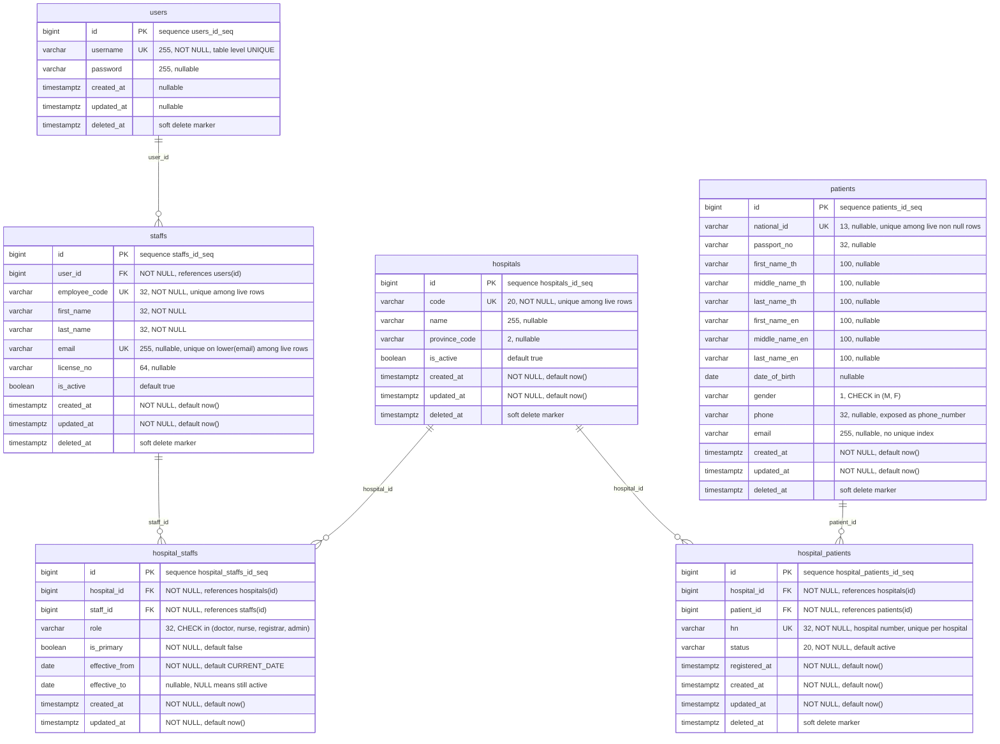

# Entity Relationship Diagram

Generated from [000001_init-tables.up.sql](../src/business/sdk/migrate/sql/000001_init-tables.up.sql).
Keep this file in step with the migration whenever the schema changes.

- **Tables**: 6 (`users`, `hospitals`, `patients`, `staffs`, `hospital_patients`,
  `hospital_staffs`), all created by a single migration
- **Last reviewed**: 2026-08-28

## Diagram

No `deleted_at` on `hospital_staffs` — it is the only table without soft delete.

## Relationships

| Parent | Child | FK column | Cardinality | Meaning |
| --- | --- | --- | --- | --- |
| `users` | `staffs` | `staffs.user_id` | 1 → 0..N | A login account backs a staff profile. See note 4 — nothing forces this to be 1:1. |
| `hospitals` | `hospital_patients` | `hospital_patients.hospital_id` | 1 → 0..N | A hospital registers many patients. |
| `patients` | `hospital_patients` | `hospital_patients.patient_id` | 1 → 0..N | A patient can be registered at many hospitals. |
| `hospitals` | `hospital_staffs` | `hospital_staffs.hospital_id` | 1 → 0..N | A hospital employs many staff. |
| `staffs` | `hospital_staffs` | `hospital_staffs.staff_id` | 1 → 0..N | A staff member can serve several hospitals over time. |

Both junction tables resolve a many-to-many relationship and carry their own data, so
they are entities in their own right rather than pure link tables:

- `patients` **N:M** `hospitals` through `hospital_patients`, which adds the hospital
  number (`hn`), a registration `status` and `registered_at`.
- `staffs` **N:M** `hospitals` through `hospital_staffs`, which adds `role`,
  `is_primary` and the `effective_from`/`effective_to` validity period.

Every FK column is `NOT NULL`, so a child row always has exactly one parent. No
`ON DELETE` action is declared, so postgres defaults to `NO ACTION`: a hard delete of a
referenced parent is rejected while children exist.

## Constraints and indexes

### users
| Object | Definition | Purpose |
| --- | --- | --- |
| `users_pkey` | `PRIMARY KEY (id)` | |
| table UNIQUE | `username` | Unique across **all** rows, including soft-deleted ones — a deleted username is never reusable. |
| `idx_users_deleted_at` | partial on `deleted_at` where `deleted_at IS NULL` | Live-row marker index. |

### hospitals
| Object | Definition | Purpose |
| --- | --- | --- |
| `hospitals_pkey` | `PRIMARY KEY (id)` | |
| `uq_hospitals_code` | unique on `code` where `deleted_at IS NULL` | One live hospital per code; soft-deleting frees the code. |
| `idx_hospitals_deleted_at` | partial on `deleted_at` | Live-row marker index. |

### patients
| Object | Definition | Purpose |
| --- | --- | --- |
| `patients_pkey` | `PRIMARY KEY (id)` | |
| gender check | `gender IN ('M','F')` | `NULL` is still allowed. |
| `uq_patients_national_id` | unique on `national_id` where `national_id IS NOT NULL AND deleted_at IS NULL` | One live patient per national id; patients identified only by passport are exempt. |
| `idx_patients_deleted_at` | partial on `deleted_at` | Live-row marker index. |
| — | `passport_no`, `phone`, `email`, all six name columns | No index and no uniqueness, although `GET /patient/search` filters on every one of them. See note 8. |

### staffs
| Object | Definition | Purpose |
| --- | --- | --- |
| `staffs_pkey` | `PRIMARY KEY (id)` | |
| FK | `user_id → users(id)` | |
| `uq_staff_employee_code` | unique on `employee_code` where `deleted_at IS NULL` | One live staff per employee code. |
| `uq_staff_email` | unique on `lower(email)` where `deleted_at IS NULL` | Case-insensitive email uniqueness. `NULL` emails never collide, but two empty strings would — which is why the store writes `NULL` instead of `''`. |
| `idx_staffs_deleted_at` | partial on `deleted_at` | Live-row marker index. |

### hospital_patients
| Object | Definition | Purpose |
| --- | --- | --- |
| `hospital_patients_pkey` | `PRIMARY KEY (id)` | |
| FK | `hospital_id → hospitals(id)`, `patient_id → patients(id)` | |
| `uq_hospital_patients_hn` | unique on `(hospital_id, hn)` where `deleted_at IS NULL` | An HN is unique within a hospital, not globally. |
| `uq_hospital_patients_pair` | unique on `(hospital_id, patient_id)` where `deleted_at IS NULL` | A patient is registered at a hospital at most once. |
| `idx_hospital_patients_patient` | on `patient_id` | Supports "which hospitals know this patient". |
| `idx_hospital_patients_deleted_at` | partial on `deleted_at` | Live-row marker index. |
| — | `status` | `NOT NULL DEFAULT 'active'` with **no** `CHECK`, unlike `patients.gender` and `hospital_staffs.role`. Any 20-character string is accepted. |

### hospital_staffs
| Object | Definition | Purpose |
| --- | --- | --- |
| `hospital_staffs_pkey` | `PRIMARY KEY (id)` | |
| FK | `hospital_id → hospitals(id)`, `staff_id → staffs(id)` | |
| role check | `role IN ('doctor','nurse','registrar','admin')` | `NULL` is still allowed. |
| `ck_sha_period` | `effective_to IS NULL OR effective_to >= effective_from` | No assignment ends before it starts. |
| `uq_sha_active` | unique on `(staff_id, hospital_id)` where `effective_to IS NULL` | At most one *open* assignment per staff-hospital pair; closed ones may repeat, so history is possible. |
| `uq_sha_one_primary` | unique on `staff_id` where `is_primary AND effective_to IS NULL` | A staff member has at most one primary hospital at a time. |
| `ix_sha_lookup` | on `(staff_id, effective_to)` | Supports "current assignments of this staff". |

## Design notes

1. **Soft delete everywhere but one table.** Five tables carry `deleted_at` and every
   read filters on `deleted_at IS NULL`. `hospital_staffs` has no such column, so
   deleting an assignment is permanent; closing it with `effective_to` is the
   history-preserving alternative.
2. **Uniqueness is scoped to live rows** through partial indexes — except
   `users.username`, which is a table-level `UNIQUE` and therefore also binds
   soft-deleted rows. That asymmetry is worth deciding on deliberately.
3. **Sequences exist but are not wired as defaults.** Each table gets a
   `CREATE SEQUENCE ... OWNED BY <table>.id`, yet no `id` column declares
   `DEFAULT nextval(...)`, so an insert must supply the id. The stores call
   `nextval()` explicitly to compensate. Tracked as a P0 item in
   [development-plan.md](./development-plan.md).
4. **`staffs.user_id` has no unique constraint**, so the schema permits several staff
   rows per user account even though the intent reads as one-to-one. Add a unique index
   if that is the rule.
5. **Unindexed foreign keys.** Postgres does not index FK columns automatically:
   `staffs.user_id` and `hospital_staffs.hospital_id` have no supporting index
   (`uq_sha_active` starts with `staff_id`, so it cannot serve a `hospital_id`-only
   lookup). Both matter for "list the staff of this hospital" queries and for parent
   delete checks.
6. **The `idx_*_deleted_at` partial indexes only ever store NULL keys.** They can serve
   a bare `WHERE deleted_at IS NULL` scan, but a composite partial index — for example
   `(national_id) WHERE deleted_at IS NULL` — is what actually accelerates the filtered
   lookups the application performs.
7. **Patient identity is loose by design.** Both `national_id` and `passport_no` are
   nullable and only `national_id` is unique, which allows foreign patients while
   admitting duplicates identified solely by passport.
8. **The patient search path is unindexed.** `patientdb.applyFilters` builds
   `lower(first_name_th) = lower(:v) OR lower(first_name_en) = lower(:v)` for each name
   part and `lower(email) = lower(:email)`, and matches `phone` and `passport_no`
   directly. None of those columns carries an index, and the two `lower(...)`
   comparisons need *expression* indexes, so every search is a sequential scan over
   live patients. The fix is a set of partial expression indexes, e.g.
   `CREATE INDEX ON patients (lower(last_name_th)) WHERE deleted_at IS NULL`.
9. **`patients.email` exists in the table but in no constraint.** Unlike
   `staffs.email` it is neither unique nor indexed, so two live patients may share an
   address — deliberate for family accounts, but worth stating rather than inheriting.
